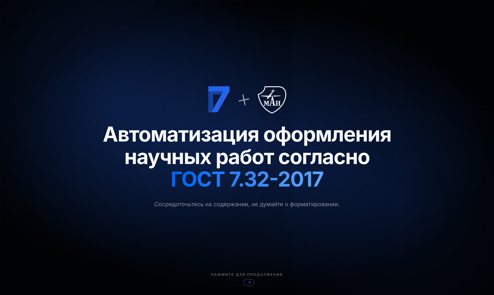

# Typst Gost Pitch — Интерактивная веб-презентация

<a href="https://github.com/typst-gost/pitch/blob/main/LICENSE"></a>
<a href="https://github.com/typst-gost/pitch/actions"></a>
<a href="https://pitch.typst-gost.ru"></a>

Интерактивная презентация для проекта [Typst Gost](https://typst-gost.ru). 
Проект представляет собой кастомный движок для слайдов, написанный на **Next.js** и **React**, с богатыми анимациями на базе **Framer Motion**.



## Функционал

- **Кастомный движок слайдов:** Удобная навигация, интерактивный обзор (сетка слайдов), счетчики страниц.
- **Workshop Mode (Мастерская):** Анимированный пошаговый ввод кода (эффект Typewriter), имитирующий живое написание Typst-кода с визуализацией изменений.
- **Telegram Интеграция:** Live-счетчик участников Telegram-сообщества, работающий напрямую через API Telegram бота.
- **Продвинутые анимации:** Плавные переходы (Zoom, Slide), анимированный background с плавающими частицами и бегущими строками.
- **Темная тема из коробки:** Оптимизировано для проекторов и экранов благодаря высококонтрастной палитре.

## Технологический стек

- **Фреймворк:** Next.js (App Router), React
- **Стилизация:** Tailwind CSS v4, shadcn/ui
- **Анимации:** Framer Motion
- **Деплой:** Docker, Bun

## Интеграция с Telegram (Live-счетчик)

В проекте реализована фича показа актуального количества участников Telegram-чата на слайде `QRLinkSlide`. 

**Как это работает:**
Специальный API-роут (`/api/telegram-members/route.ts`) делает запрос к серверам Telegram с использованием токена бота, получая `getChatMemberCount`.

**Для настройки:**
1. Создайте бота через [@BotFather](https://t.me/BotFather).
2. Добавьте бота в ваш чат/канал.
3. Добавьте токен бота в файл `.env` (или `.env.local`):

```env
TELEGRAM_BOT_TOKEN=123456789:YOUR_SUPER_SECRET_TOKEN
```

## Примеры кода

### 1. Создание базового слайда
Все слайды объявляются в виде массива компонентов в `app/page.tsx`. Вы можете комбинировать различные макеты:

```tsx
import { Presentation } from "@/components/presentation/presentation"
import { TitleSlide } from "@/components/presentation/slides/title-slide"
import { ThreeColumnSlide } from "@/components/presentation/slides/three-column-slide"

const slides =[
  <TitleSlide
    key="title"
    title="Автоматизация оформления по ГОСТ 7.32-2017"
    subtitle="Сосредоточьтесь на содержании, не думайте о форматировании."
  />,
  <ThreeColumnSlide
    key="features"
    title="Почему Typst?"
    columns={[
      { title: "Скорость", description: "Молниеносная компиляция" },
      { title: "Простота", description: "Чистый синтаксис" },
      { title: "ГОСТ", description: "Соответствие стандартам" },
    ]}
  />
]

export default function App() {
  return <Presentation slides={slides} />
}
```

### Слайд "Мастерская" (WorkshopSlide)
Этот слайд имитирует живое написание кода. Массив `steps` описывает действия "печатной машинки" (ввод текста, паузы, стирание):

```tsx
<WorkshopSlide
  key="workshop-example"
  title="Формулы"
  subtitle="Мастерская"
  hiddenPrefix={"#set page(fill: white)\n"}
  steps={[
    { action: "type", text: "*Расчет суммы:*\n", closing: "*" },
    { action: "type", text: "$ sum_(k=0)^n k = (n(n+1)) / 2 $", closing: " $" },
    { action: "pause", delay: 400 },
    { action: "type", text: "\n\n*Уравнение в строке:* $A = pi r^2$", closing: "$" }
  ]}
  typeSpeed={80}
/>
```

### Слайд с Telegram-счетчиком
Использование компонента `QRLinkSlide` с включенным параметром `showMembersCounter`:

```tsx
<QRLinkSlide
  key="community"
  title="Сообщество Typst Gost"
  subtitle="Telegram"
  description="Присоединяйтесь к нам!"
  link="https://t.me/typst_gost"
  linkLabel="Присоединиться"
  showMembersCounter={true}       // Включает запрос к API
  telegramChatId="@typst_gost"    // ID чата для проверки количества участников
/>
```

## Установка и запуск локально

Проект использует `bun` в качестве основного пакетного менеджера (согласно Dockerfile), но вы можете использовать `npm` или `pnpm`.

1. **Клонируйте репозиторий:**
   ```bash
   git clone <url-вашего-репозитория>
   cd pitch
   ```

2. **Установите зависимости:**
   ```bash
   bun install
   ```

3. **Настройте переменные окружения:**
   Скопируйте пример файла `.env` (если есть) или создайте новый `.env.local`:
   ```bash
   echo "TELEGRAM_BOT_TOKEN=ваш_токен" > .env.local
   ```

4. **Запустите сервер разработки:**
   ```bash
   bun run dev
   ```
   Приложение будет доступно по адресу[http://localhost:3000](http://localhost:3000).

## Запуск через Docker

В проекте уже настроен `Dockerfile` на базе образа `oven/bun`.

```bash
docker build -t typst-pitch .
docker run -p 3000:3000 --env TELEGRAM_BOT_TOKEN=ваш_токен typst-pitch
```
